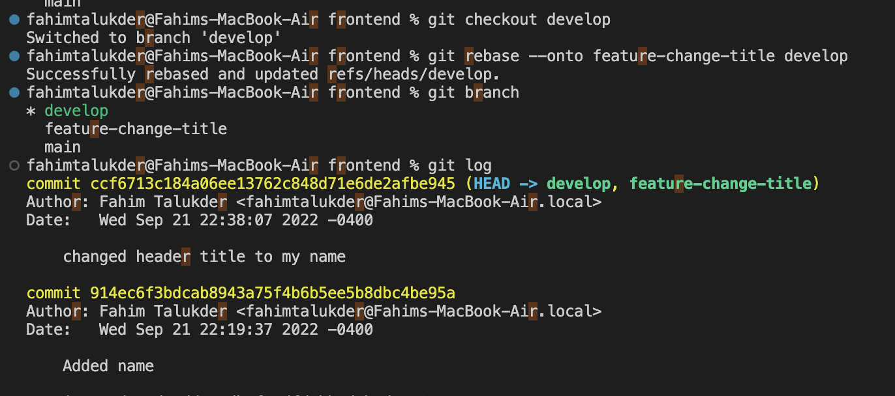
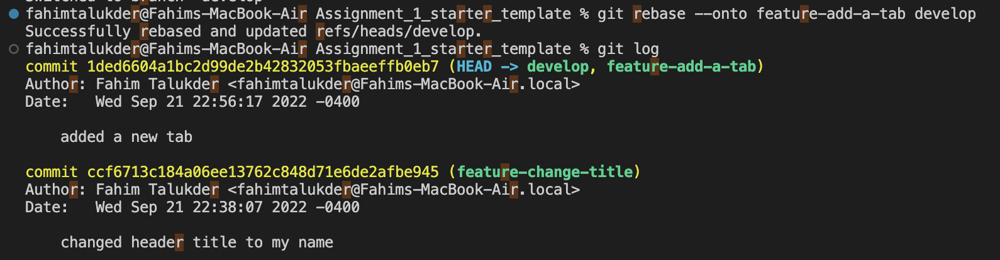
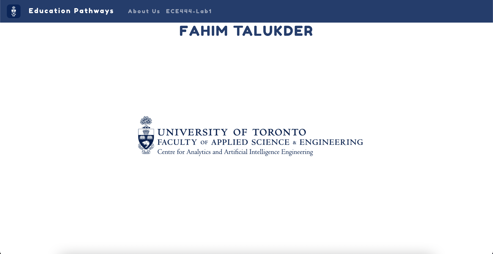

# ECE444-F2022-Lab1
Course Work in ECE444 for Lab 1 

Fahim

#Act 1

#Act 2

#Act 3

#Act 4 

#Image 1 - Partner's Commit 

#image 2 - My Commit 

#Act 5

#Image 1 - Commits

#Image 2 - Final Rebase (w/ Origin) and Develop Pushes

#Act 6 
Link to EP Repo: https://github.com/FahimRT/ECE444-F2022-EP 

#Act 7

#Act 8

